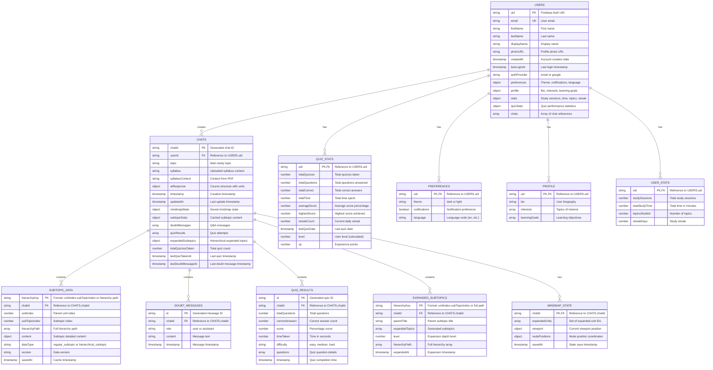

# AceMind Database Entity Relationship Diagram

## Collections Overview

### Primary Collections

1. **users** - User accounts and profiles
2. **chats** - Learning sessions with course content

### Embedded Sub-Collections (within chats)

3. **subtopicData** - Cached subtopic content (keyed by hierarchy)
4. **doubtMessages** - Q&A conversation history
5. **quizResults** - Quiz attempt records
6. **expandedSubtopics** - Hierarchically expanded topics
7. **mindmapState** - Saved mindmap visualization state

### Embedded Objects (within users)

8. **quizStats** - Quiz performance tracking
9. **preferences** - User settings
10. **profile** - User bio and interests
11. **stats** - Study activity metrics

## Key Relationships

- **Users to Chats**: One-to-Many (One user creates multiple learning sessions)
- **Chats to Subtopic Data**: One-to-Many (One chat contains multiple cached subtopics)
- **Chats to Doubt Messages**: One-to-Many (One chat has multiple Q&A messages)
- **Chats to Quiz Results**: One-to-Many (One chat tracks multiple quiz attempts)
- **Chats to Expanded Subtopics**: One-to-Many (One chat has multiple expansion levels)
- **Chats to Mindmap State**: One-to-One (One chat has one mindmap state)
- **Users to Quiz Stats**: One-to-One (Aggregated quiz performance)

## Data Sanitization

The system includes special handling for nested arrays in Firebase:

- **sanitizeForFirebase()**: Converts nested arrays to objects before storage
- **restoreFromFirebase()**: Restores objects back to arrays after retrieval
- This prevents Firebase nested array limitations

## Authentication Providers

- Email/Password authentication
- Google OAuth authentication
- Password reset functionality

## Cache Management

- Subtopic content is cached with hierarchy keys
- Cache statistics tracking (size, age, type)
- Selective or full cache clearing capabilities
